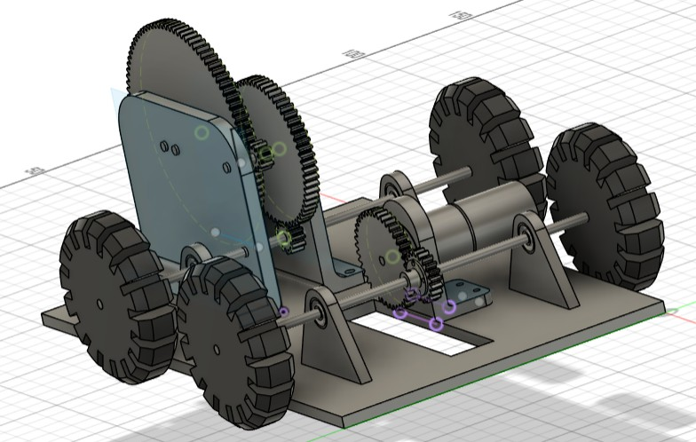
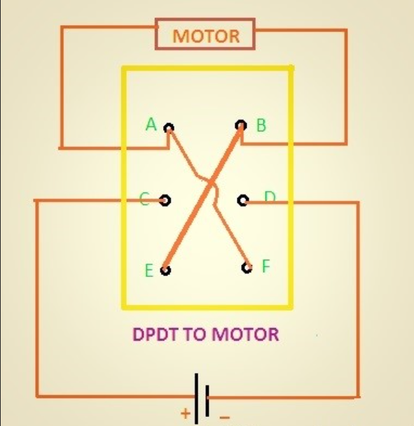

# Gear-Driven Return-to-Start Car

A front-wheel-drive car that drives down a lane to a wall, reverses, and comes back to stop where it started. It has no microcontroller. The reversing is done with a DPDT switch, and the stopping is done with a gear train and a microswitch.

This was a Year 1 group project at Manchester Metropolitan University.

## Demo

[Demo video](./assets/demo.mp4). The car goes down a taped lane to a wooden wall, reverses, and stops on a target mat.

## How it works

### Drive

The motor is a 6V DC motor that runs at 35 RPM with no load. A 40-tooth gear on the motor meshes with a 20-tooth gear on the front axle, so the front axle turns at 70 RPM. This gives up some torque to gain speed. The rear axle isn't driven. It just turns as the car rolls.

### Reversing

A DPDT switch swaps which way the motor is connected to the battery, which makes the motor turn the other way. When the front of the car hits the wall, the front switch is hit and the motor reverses, so the car drives back. A separate on/off switch controls the power, and there is a fuse in the circuit for safety.

Diagram from electroconcepts.wordpress.com (via the module handbook), used as a reference for the wiring. It isn't our own drawing.

### Stopping at the start

The rear axle turns as the car moves, so we used it to keep track of how far the car has gone. It drives a set of gears that slows the rotation right down:

- a 12-tooth gear on the rear axle drives a 60-tooth gear
- the 60-tooth gear shares a shaft with a 10-tooth gear, which drives a 94-tooth gear with a prong on it

Overall this is a 1:47 reduction, so the prong gear turns once for every 47 turns of the wheels. It is set up to turn about 0.9 of a turn on the way to the wall. When the car reverses, the gears run backwards and the prong turns back by the same amount. When the car is back at the start, the prong hits a microswitch and cuts the power. The prong never makes a full turn, so it can only hit the microswitch at the start position.

## Calculations

We sized the drive using the method in the module's design handbook: work out the speed needed for the distance, pick a wheel size, then pick gears so the motor speed matches the wheel speed, using whole numbers of teeth.

**Drive**

- Gear ratio = 20 / 40 = 0.5, so the axle turns twice as fast as the motor
- 35 RPM x 2 = 70 RPM at the front axle
- The wheel diameter is 70 mm, so speed = π x 0.07 x 70 / 60 = about 0.257 m/s

These numbers use the no-load motor speed and assume the wheels don't slip, so the real car will be a bit slower.

**Stopping mechanism**

Both axles have 70 mm wheels, so the rear axle also turns at about 70 RPM.

| Stage | Gears | Ratio | Speed out |
|---|---|---|---|
| 1 | 12T to 60T | 12/60 = 1:5 | 70 to 14 RPM |
| 2 | 10T to 94T | 10/94 = 1:9.4 | 14 to about 1.49 RPM |
| Overall | | 1:47 | Prong gear turns once per 47 rear-wheel turns |

## Bill of materials

| Component | Qty | Notes | Cost |
|---|---|---|---|
| 6V motor | 1 | 35 RPM no-load | £9.71 |
| Wheel bearings | 4 | Smoother axle rotation | £11.00 |
| Wheels | 4 | | £0.90 |
| Rubber bands | 4 | Wheel tyres | £0.10 |
| Large gear | 1 | 5mm acrylic | £0.25 |
| Medium two-gear piece | 1 | 5mm acrylic | £0.37 |
| Small gears | 2 | 5mm acrylic | £0.18 |
| Mini gears | 2 | 5mm acrylic | £0.09 |
| Acrylic plank (26 x 10 cm) | 1 | 5mm acrylic, chassis | £1.84 |
| Axle holders | 4 | 5mm acrylic | £0.30 |
| Acrylic prong | 1 | 5mm acrylic, stopping mechanism | £0.06 |
| Steel rod (19 cm) | 2 | | £0.75 |
| Steel rod (12 cm) | 1 | | £0.24 |
| Steel rod (7 cm) | 1 | | £0.14 |
| PCB switch | 1 | DPDT reversing switch | £2.36 |
| On/off switch | 1 | Main power | £0.32 |
| Microswitch | 1 | Stops the car when hit by the prong | £0.35 |
| Fuse holder with fuse | 1 | Overcurrent protection | £0.05 |
| Batteries | 4 | | £3.32 |
| Battery holder | 1 | | £0.25 |
| Battery holder clip | 1 | | £0.25 |
| Wires | 12 | | £1.20 |
| Wall brackets | 2 | | £0.54 |
| Plastic wall piece | 1 | | £0.14 |
| Steel hook | 1 | | £1.30 |
| **Total** | | | **£36.01** |

The budget for the project was £50. The screws were standard lab hardware and aren't modelled in the CAD.

## Files

- `CAD for mechanical car.f3z`: the Fusion 360 assembly
- `CAD For Mechanical Car.step`: the same model in a format that opens without Fusion
- `Bill of Materials.xlsx`: the full cost breakdown
- `assets/demo.mp4`: video of the car running
- `assets/dpdt_circuit.png`: DPDT wiring diagram
- `assets/cad_render.jpg`: screenshot of the CAD assembly

## What we'd improve

- Add the screws to the CAD model. They're left out at the moment.
- Get the motion simulation in Fusion 360 working. It didn't run properly on our model.
- Measure how close to the start the car actually stops over several runs.
